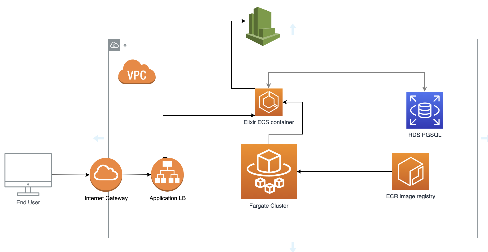
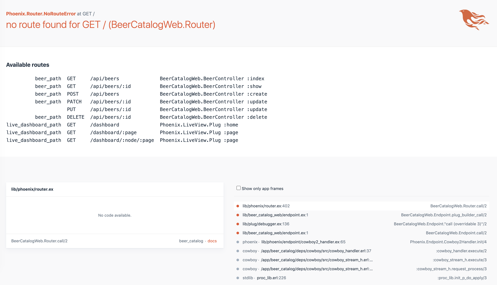

# <b>Infrastructure As Code API </b>

## <b>Repo description</b>

This a terraform repository for providing a simple Infrastructure for an API application in AWS. In this case, will provide the API from the [Elixir API repo](https://github.com/seavba/elixir-api).

The Infrastructure provided by this repo consists on an AWS ECS container over an AWS Fargate cluster serving an API application through an AWS ALB, which it´s reached from the Internet thorugh the AWS IG. The container gets the data from an AWS RDS PGSQL database.



<br/><br/>

Security and target Groups, IAM policies, VPC and so on, are already provided by this repo.

## Getting Started

#### Pre-requisites
> :warning: Create ECR image (if you didn't do it before)

- [Elixir-api repo for creating image](https://github.com/seavba/elixir-api)

- AWS CLI must be already configured. If not, try [Configuration and credential file settings](https://docs.aws.amazon.com/cli/latest/userguide/cli-configure-files.html)

- The iac-api Terrafrom module has been wrote with Terraform v0.15.3.

#### Deploy
Once Elixir docker image has been created, for providing such infrastructure, it's needed to run:

```
cd /your/repo/path
git clone  git@github.com:seavba/iac-api.git
cd iac-api && terraform init && terraform apply
```
```terraform apply``` command asks for confirmation, write ```yes``` if you want to proceed with the deployment.


### Variables
All the variables to be customised (if needed) can be found in [variables.tf](https://github.com/seavba/iac-api/blob/master/variables.tf) file.

#### Mandatory variables to be defined:
- <b>ecr_repo_url</b> Must have the URL for the ECR repository to be used. For example: ```your_account_id.dkr.ecr.your_region.amazonaws.com```

#### Output Variables

After deployment, as output variables are shown:

```
Apply complete! Resources: 23 added, 0 changed, 0 destroyed.

Outputs:

api_url = "elixirLB-81803355.eu-west-1.elb.amazonaws.com"
elixirDB_endpoint = "elixir.cauwadl2xq0q.eu-west-1.rds.amazonaws.com:5432"
```

> :warning: <i>api_url</i>  variable is the URL to navigate through the API application. Once deployment is done, wait for 5 minutes and paste it on your browser. A Phoenix webpage must be shown


<br/><br/>


### Destroy Infrastructure

```
cd /your/repo/path
cd iac-api && terraform destroy
```
```terraform destroy``` command asks for confirmation, write ```yes``` if you want to proceed with the deployment revert.

### API calls

```
beer_path  GET     /api/beers              BeerCatalogWeb.BeerController :index
beer_path  GET     /api/beers/:id          BeerCatalogWeb.BeerController :show
beer_path  POST    /api/beers              BeerCatalogWeb.BeerController :create
beer_path  PATCH   /api/beers/:id          BeerCatalogWeb.BeerController :update
          PUT     /api/beers/:id          BeerCatalogWeb.BeerController :update
beer_path  DELETE  /api/beers/:id          BeerCatalogWeb.BeerController :delete
```

```
$ curl http://elixirlb-934871717.eu-west-1.elb.amazonaws.com/api/beers
{"data":[{"brand":"Milwaukee's Best Light","id":"91ad0210-60d4-49b3-bac5-b34bf7ff86fc","origin":"USA","quantity":1200,"style":"American-Style Light Lager"},{"brand":"Dos Equis","id":"e494481f-8537-45ea-ab7d-a37add0ee1a5","origin":"Mexico","quantity":430,"style":"Lager Especial"},{"brand":"Maibock","id":"18c7d361-c515-4608-821a-c294797a8ead","origin":"Germany","quantity":4000,"style":"Bavarian lager"}]}
```


## Webgraphy

The following websites helped me to understand better how to implement the solution:

- [Link 1](https://medium.com/avmconsulting-blog/how-to-deploy-a-dockerised-node-js-application-on-aws-ecs-with-terraform-3e6bceb48785)

- [Link 2](https://medium.com/adobetech/deploy-microservices-using-aws-ecs-fargate-and-api-gateway-1b5e71129338)

- [Link 3](https://www.chakray.com/es/creacion-aws-ecs-task-fargate-terraform/)
